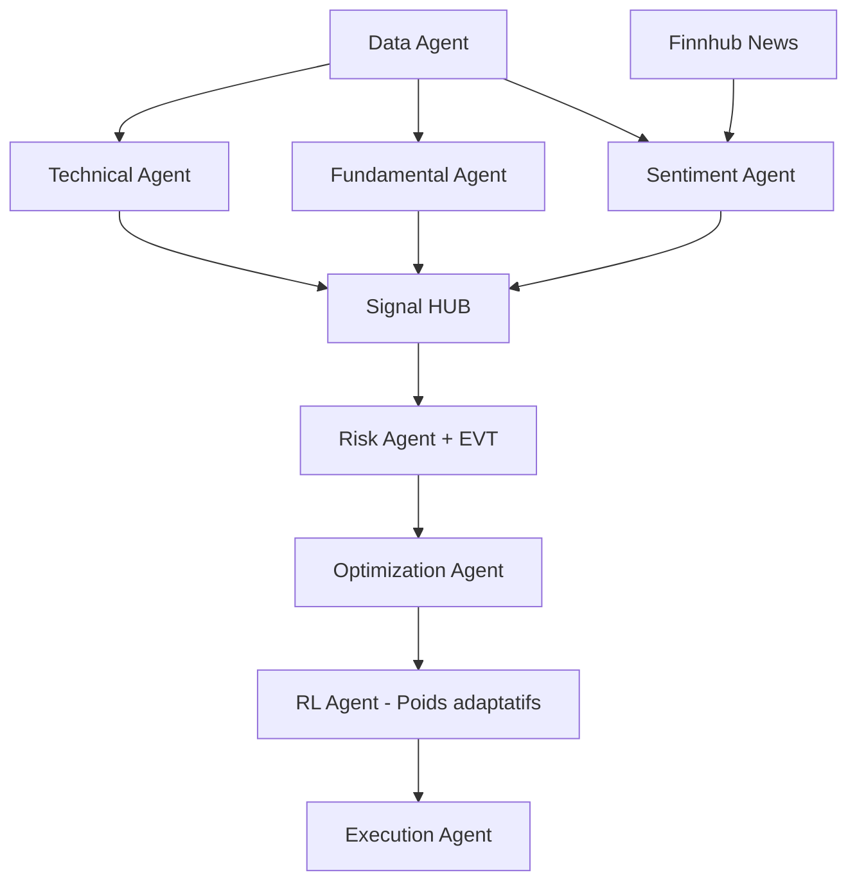

# Spécifications AlphaBot - Trading Bot Multi-Agents

## 1. Objectifs

### Vision
Développer un système de trading algorithmique basé sur une architecture multi-agents utilisant CrewAI, capable de prendre des décisions d'investissement autonomes sur les marchés actions.

### Objectifs clés (OKRs)

| Objectif | Résultat clé | Métrique | Target |
|----------|--------------|----------|---------|
| Performance | Sharpe ratio annualisé | Ratio rendement/volatilité | ≥ 1.5 |
| Gestion risque | Drawdown maximum | % de perte maximale | ≤ 15% |
| Efficacité opérationnelle | Hit Ratio | % positions gagnantes | ≥ 60% |
| Fiabilité | Uptime système | % de disponibilité | ≥ 99.5% |
| Couverture | Univers d'investissement | Nombre d'actifs | S&P 500 + STOXX 600 + Nikkei 225 |

## 2. Univers d'investissement

### Actions ciblées
- **S&P 500** : 500 titres US large cap
- **STOXX 600** : 600 titres européens  
- **Nikkei 225** : 225 titres japonais (diversification Asie)
- **Total** : ~1300 actifs
- **Exclusions** : Penny stocks (<$5), volume quotidien <1M$

### Sources de données

#### Prix & Volume
- **Primary** : Alpha Vantage, Yahoo Finance
- **Backup** : [FinancialModelingPrep](https://financialmodelingprep.com) (EOD/intraday 5-15min, OHLCV, VWAP)
- **Realtime** : [Finnhub.io](https://finnhub.io) (websocket trades, gratuit avec limits)

#### Données fondamentales
- **SEC filings** : FinancialModelingPrep API
- **Open-source** : [GitHub datasets](https://github.com) (Revenue, Cashflow, Stock-Based Compensation pour TSLA, META, NVDA, AAPL)
- **ESG** : Datasets Hugging Face financials

#### Sentiment & News
- **Primary** : NewsAPI, Twitter/Reddit (limité <300 req/15min)
- **Backup** : [Finnhub.io](https://finnhub.io) (news/press releases realtime)
- **Fallback** : Hugging Face datasets financial-news

## 3. Architecture technique

### Stack technologique
- **Orchestration** : CrewAI
- **Base de données** : DuckDB (local), Redis (cache)
- **ML/Data** : Polars, Riskfolio-Lib, FinBERT
- **Broker** : Interactive Brokers (ib_insync)
- **Monitoring** : Streamlit dashboard + MLflow
- **Expériences ML** : MLflow (tracking local gratuit)

### Agents principaux

#### 3.1 Data Agent
- **Responsabilité** : Ingestion et validation des données
- **QC** : Détection valeurs aberrantes, gaps, volumes
- **KPI** : % gaps comblés ≥95%

#### 3.2 Technical Agent  
- **Indicateurs** : EMA 20/50, RSI, ATR, Bollinger Bands
- **Signaux** : Long/Short/Hold avec conviction 0-100%
- **Stop loss** : ATR-based (2x ATR 14 jours)

#### 3.3 Fundamental Agent
- **Métriques** : P/E, P/B, ROE, Score Piotroski-F
- **Sources** : SEC filings + GitHub datasets open-source
- **Output** : Score valeur 0-100%

#### 3.4 Sentiment Agent
- **NLP** : FinBERT fine-tuné ESG
- **Sources** : Twitter, Reddit, Finnhub news
- **Agrégation** : Sentiment score -1 à +1
- **Risk overlay** : Si score <-0.5 → réduire exposition 30%

#### 3.5 Risk Agent
- **VaR** : 95% et 99% confidence, horizon 1-10 jours
- **Expected Shortfall** : 97.5%
- **EVT** : Calcul batch mensuel tail-risk (GPD pour queues >2σ)
- **Stress tests** : Scénarios historiques (2008, 2020)

#### 3.6 Optimization Agent
- **Méthode** : Hierarchical Risk Parity (HRP)
- **Contraintes** : Max 30% par secteur, 5% par titre
- **Rebalancing** : Hebdomadaire ou seuil 20% drift

#### 3.7 Execution Agent
- **Ordres** : Market, Limit, Stop-Loss
- **Slippage** : Modèle basé sur volume/spread
- **Retry logic** : 3 tentatives, exponential backoff

#### 3.8 RL Agent (optionnel, feature flag)
- **Responsabilité** : Fine-tuning poids signaux via FinRL-DeepSeek
- **Input** : Backtests performance, Alpha Vantage data
- **Output** : Poids adaptatifs (40% Technical → dynamique)
- **Retraining** : Hebdomadaire

## 4. Gestion des risques

### Limites de position
- **Exposition max** : 95% du capital
- **Single stock** : Max 5% du portfolio
- **Secteur** : Max 30% par secteur GICS
- **Géographique** : Max 70% US, 20% Europe, 10% Asie

### Métriques de suivi
- **VaR 95%** : Max 3% capital quotidien
- **Expected Shortfall** : Max 5% capital (inclut EVT)
- **Corrélation portfolio** : Max 0.7 moyenne pondérée
- **Turnover** : Max 50% mensuel

### Vetos dynamiques
- **Risk Agent** : Peut bloquer toute position
- **Sentiment veto** : Score NLP <-0.5 → réduction exposition
- **Conviction seuil** : Signal agrégé <50% → Hold

## 5. Workflow de décision

### Fusion des signaux
- **Poids dynamiques** : Technical 40%, Fundamental 35%, Sentiment 25% (ajustés par RL)
- **Seuils** : Signal agrégé >60% → Long, <40% → Short, <50% → Hold
- **Vetos** : Risk agent + sentiment overlay

## 6. KPIs et monitoring

### Performance
- **Sharpe ratio** : Rolling 30/90/252 jours
- **Information ratio** : vs benchmark S&P 500
- **Calmar ratio** : Rendement/Max Drawdown
- **Hit ratio** : % positions gagnantes (target ≥60%)

### Risque
- **VaR violations** : % jours VaR dépassé
- **Tracking error** : Volatilité rendements relatifs
- **Beta** : Sensibilité au marché
- **Maximum Drawdown** : Perte peak-to-trough

### Technique
- **Latence signaux** : Temps data → décision (via Finnhub websocket)
- **Uptime agents** : % disponibilité chaque agent
- **Fill ratio** : % ordres exécutés
- **Slippage moyen** : Écart prix théorique/réel
- **Data qualité** : % gaps comblés ≥95%

## 7. Environnements

### Développement
- **Paper trading** : IBKR sandbox
- **Data** : Gratuit (Alpha Vantage + FinancialModelingPrep + GitHub datasets)
- **Fréquence** : Tests quotidiens

### Production  
- **Capital initial** : 10,000€
- **Broker** : Interactive Brokers live
- **Data** : Alpha Vantage Premium (si gratuit insuffisant)
- **Monitoring** : 24/7 dashboard + Finnhub realtime

### Sécurité & Compliance
- **API keys** : HashiCorp Vault (local)
- **GDPR** : Anonymisation data scraping news
- **Code review** : Validation IA pour sécurité

## 8. Roadmap de développement

Suivre le planning détaillé en 6 phases sur 9 mois selon `plan_detaillé.md`.

### Jalons critiques enrichis
- **S4** : MVP 2 agents fonctionnels
- **S12** : Portfolio optimizer + validation datasets GitHub
- **S24** : Code freeze + test charge Ray (si >5 agents)
- **S32** : Go-live trading réel

### Amélioration continue
- **Retraining mensuel** : FinBERT sur nouveaux datasets Hugging Face
- **Monitoring MLflow** : Tracking expériences fine-tuning

## 9. Critères de succès

### Definition of Done (DoD)
- ✅ Code mergé sur branche `dev`
- ✅ Tests unitaires ≥ 80% coverage
- ✅ Artefact versionné (DVC/docs)
- ✅ Issue GitHub fermée
- ✅ Benchmark performance documenté
- ✅ Revue code par IA (sécurité)

### Critères Go-Live étendus
- ✅ Backtest 3 ans Sharpe ≥ 1.2 (out-of-sample)
- ✅ Paper trading 3 mois sans incident
- ✅ Stress tests validés (inclut EVT)
- ✅ Validation data bias (survivorship corrigé)
- ✅ Hit ratio ≥60% sur backtests
- ✅ Run-book opérationnel complet
- ✅ Capital de test ≤ 10k€

## 10. Prochaines étapes

### Issue P1-S1-1 : Configuration risque personnalisée
Renseigner dans `risk_policy.yaml` :
- Drawdown max acceptable (%)
- Capital par trade (€ ou %)
- Secteurs d'exclusion personnels
- Tolérance volatilité

**Action** : Fournir vos règles risque pour génération du code skeleton Data Agent.